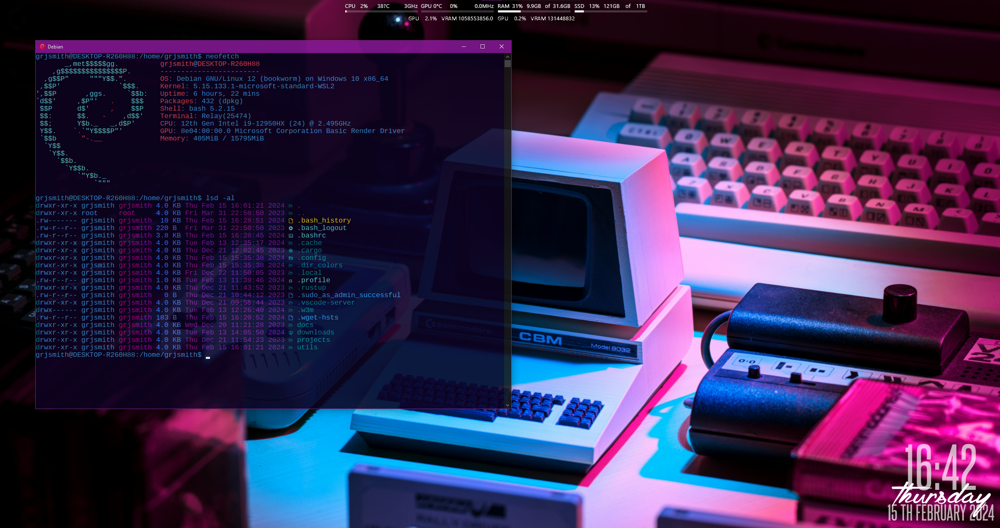

# Grant's dotfiles
<div id="top"></div>
<!--
*** Thanks for checking out the Best-README-Template. If you have a suggestion
*** that would make this better, please fork the repo and create a pull request
*** or simply open an issue with the tag "enhancement".
*** Don't forget to give the project a star!
*** Thanks again! Now go create something AMAZING! :D
-->


<!-- PROJECT LOGO -->
<br />
<div align="center">
  <a href="https://github.com/grjsmith/dotfiles">
    
  </a>

<h1 align="center">clean-text-and-graphs-for-rainmeter</h1>

  <p align="center">
    Clean system monitors for rainmeters where vertical space is a premium.
    <br />
    <a href="https://github.com/grjsmith/clean-text-and-graphs-for-rainmeter"><strong>Explore the docs »</strong></a>
    <br />
    <br />
    <a href="https://github.com/grjsmith/clean-text-and-graphs-for-rainmeter/issues">Report Bug</a>
    ·
    <a href="https://github.com/grjsmith/clean-text-and-graphs-for-rainmeter/issues">Request Feature</a>
  </p>
</div>


<!-- TABLE OF CONTENTS -->
<details>
  <summary>Table of Contents</summary>
  <ol>
    <li>
      <a href="#about-the-project">About The Project</a>
      <ul>
        <li><a href="#built-with">Built With</a></li>
      </ul>
    </li>
    <li>
      <a href="#getting-started">Getting Started</a>
      <ul>
        <li><a href="#prerequisites">Prerequisites</a></li>
        <li><a href="#installation">Installation</a></li>
      </ul>
    </li>
    <li><a href="#usage">Usage</a></li>
    <li><a href="#roadmap">Roadmap</a></li>
    <li><a href="#contributing">Contributing</a></li>
    <li><a href="#license">License</a></li>
    <li><a href="#contact">Contact</a></li>
    <li><a href="#acknowledgments">Acknowledgments</a></li>
  </ol>
</details>

<!-- ABOUT THE PROJECT -->
## About The Project
The concept is simple. I like system monitors in Rainmeter. I have a large 21:9 monitor so I can spare a little screenspace at the top of my display. So I wanted reasonably feature rich system monitors that occupied a small amount of vertical space but could use as much horizontal space as needed.
<p align="right">(<a href="#top">back to top</a>)</p>

### Built With

* [Rainmeter](https://www.rainmeter.net/)
* [MSI Afterburner](https://www.msi.com/Landing/afterburner/graphics-cards)
* [MSI Afterburner DLL](https://forums.guru3d.com/threads/rainmeter-plugin-for-msi-afterburner.319558/)

<p align="right">(<a href="#top">back to top</a>)</p>


<!-- GETTING STARTED -->
## Getting Started
### Prerequisites

* Download Rainmeter from [https://www.rainmeter.net/](https://www.rainmeter.net/)
* Download the skins from [my S3 bucket](https://entropybit.s3.eu-west-1.amazonaws.com/clean+text+and+graphs_1.0.rmskin)
* Download [MSI Afterburner](https://www.msi.com/Landing/afterburner/graphics-cards)
* Download the [MSI Afterburner DLL](https://forums.guru3d.com/threads/rainmeter-plugin-for-msi-afterburner.319558/) that's right for your system
### Installation
* Install Rainmeter, [following the excellent documentation if you need it](https://docs.rainmeter.net/manual/installing-rainmeter/)
* Install MSI Afterburner you don't ever need to look at it, it just needs to be running.
* Follow instructions on the [Guru3d forum](https://forums.guru3d.com/threads/rainmeter-plugin-for-msi-afterburner.319558/) to get the G-GPU skin working.
You will need to provide Administrator permissions in order to copy the file to the correct location:
```
C:\Program Files\Rainmeter\Plugins
```

<p align="right">(<a href="#top">back to top</a>)</p>

<!-- USAGE EXAMPLES -->
<!--## Usage

Use this space to show useful examples of how a project can be used. Additional screenshots, code examples and demos work well in this space. You may also link to more resources.

_For more examples, please refer to the [Documentation](https://example.com)_

<p align="right">(<a href="#top">back to top</a>)</p>-->

<!-- ROADMAP -->
## Roadmap

- I'd love to add a weather widget but everytime I do the APIs change and I haven't found one that seems stable.

See the [open issues](https://github.com/github_username/repo_name/issues) for a full list of proposed features (and known issues).

<p align="right">(<a href="#top">back to top</a>)</p>


<!-- CONTRIBUTING -->
## Contributing
Contributions are what make the open source community such an amazing place to learn, inspire, and create. Any contributions you make are **greatly appreciated**.

If you have a suggestion that would make this better, please fork the repo and create a pull request. You can also simply open an issue with the tag "enhancement".
Don't forget to give the project a star! Thanks again!

1. Fork the Project
2. Create your Feature Branch (`git checkout -b feature/AmazingFeature`)
3. Commit your Changes (`git commit -m 'Add some AmazingFeature'`)
4. Push to the Branch (`git push origin feature/AmazingFeature`)
5. Open a Pull Request

<p align="right">(<a href="#top">back to top</a>)</p>

<!-- LICENSE -->
## License
<a rel="license" href="http://creativecommons.org/licenses/by-sa/4.0/"></a><br />This work is licensed under a <a rel="license" href="http://creativecommons.org/licenses/by-sa/4.0/">Creative Commons Attribution-ShareAlike 4.0 International License</a>.

<p align="right">(<a href="#top">back to top</a>)</p>

<!-- CONTACT -->
## Contact

Grant Smith - [@grjsmith](https://twitter.com/grjsmith) - grant@nextgendevops.com

Project Link: [https://github.com/grjsmith/clean-text-and-graphs-for-rainmeter](https://github.com/grjsmith/clean-text-and-graphs-for-rainmeter)

<p align="right">(<a href="#top">back to top</a>)</p>

<!-- ACKNOWLEDGMENTS -->
## Acknowledgments
* Thanks to the Rainmeter team for the awesome tutorials
* Thanks to Nick/Stangowner for the Afterburner/Rainmeter instructions and example code.

<p align="right">(<a href="#top">back to top</a>)</p>


<!-- MARKDOWN LINKS & IMAGES -->
<!-- https://www.markdownguide.org/basic-syntax/#reference-style-links -->